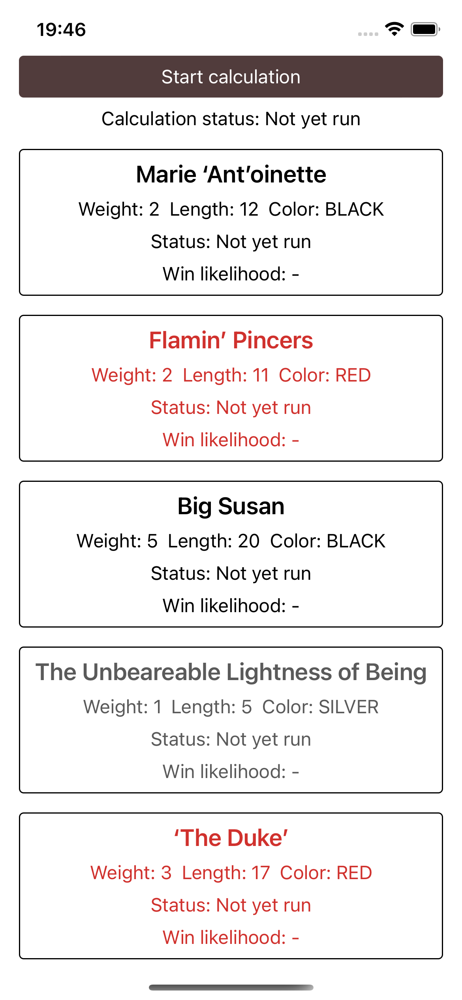
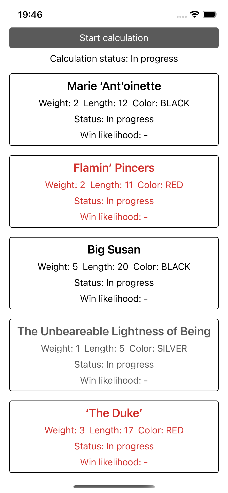
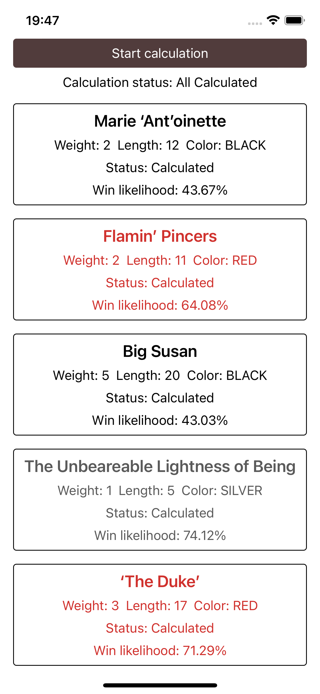

### Description:

App was created using expo.

### How to install:

```bash
npm install
```

### How to run

## iOS

```bash
npm run ios
```

## Android

```bash
npm run android
```

### ScreenShot




